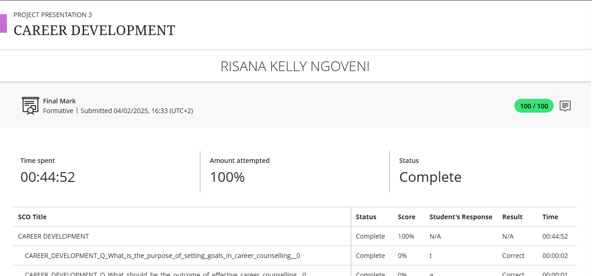
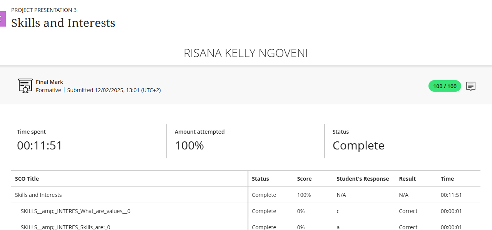
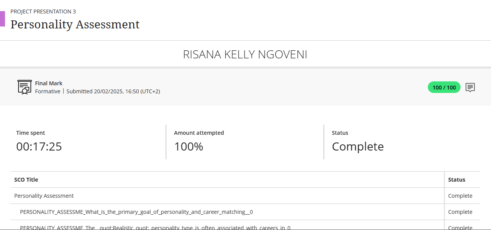
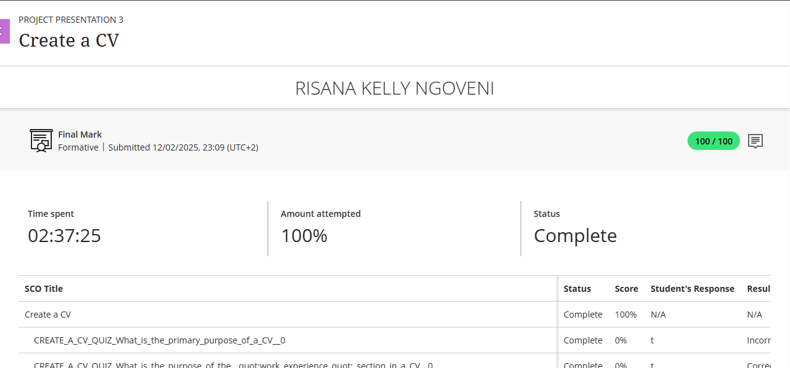

# Digital-Portfolio 

<i><b>Risana Kelly Ngoveni</b></i>

 <i>Third-Year ICT: Application Development | Cape Peninsula University of Technology</i>

 <b>Student Number:</b> 222578874

<i>Full Stack Developer/System Architect</i>

<i>Dedicated to creating innovative, efficient, and user-friendly applications with real-world relevance</i>

##  Introduction

As a third-year ICT (Application Development) student at Cape Peninsula University of Technology, I have developed a strong foundation in software development principles, systems analysis, and application design. My academic journey has shaped me into a problem-solver who is passionate about creating functional, user-centered software that addresses real-world needs.

This digital portfolio represents my growth as an aspiring software developer. It showcases key projects, practical experiences, and reflective insights that highlight my readiness to contribute meaningfully in professional environments. Whether through mobile apps, web solutions, or database-driven systems, my goal is to build impactful technologies that blend innovation with usability.

## Career Counselling

### Evidence 
- A reflective summary report based on my participation in the Career Development module, focusing on aligning my strengths and skills with current industry demands.
- Visual documentation showcasing activities and tasks completed during the career development workshop.

###  Reflection (STAR)

**S**ituation: As I approached the final stages of my studies, I realized I needed clearer direction regarding my future career path in the tech industry.  

**T**ask: My goal was to gain professional insight and practical guidance to align my personal strengths and interests with suitable career opportunities.  

**A**ction: I actively engaged with the Career Development module, completed self-assessment exercises, participated in workshops, and consulted with the campus career office.  

**R**esult: Through this process, I gained valuable clarity about the roles within tech that best align with my skills and passions—particularly in areas like software development and systems analysis—empowering me to make more informed career decisions moving forward.

---
## Skills and Interests

### 📄 Evidence

- **Core Technical Skills:**  
  Java · JavaScript · MySQL · HTML/CSS · Python · Figma · Agile · Scrum  

- **Electives (2023/2024):**  
  ▫️ *Python Programming* — Focused on logic building, data structures, and automation  
  ▫️ *Greenfoot* — Object-oriented programming using Java in a visual and interactive environment  

- **Personal Interests:**  
  Data science · Software development · UX/UI design · Gamified learning systems

###  Reflection (STAR)

**S**ituation: Throughout my academic journey, I was introduced to a wide range of technologies and development tools.  

**T**ask: I needed to identify which skills and areas of tech aligned best with my interests and strengths.  

**A**ction: I actively engaged in various tech projects and intentionally chose Data Analytics as an elective to broaden my technical perspective and explore data-driven decision-making.  

**R**esult: I developed strong data interpretation and analytical thinking skills, and discovered a genuine passion for creating systems that deliver value through meaningful insights.

## Personality Assessment

### Evidence

- **Summary:**  
  I completed a series of online self-assessments as part of the career development module. The results highlighted my dominant traits as:  
  ▫️ **Analytical** – I enjoy solving complex problems through logical thinking.  
  ▫️ **Curious** – I am eager to learn new technologies and explore innovative solutions.  
  ▫️ **Empathetic** – I consider user needs and perspectives in design and development.  
  ▫️ **Adaptive** – I adjust easily to new challenges and fast-paced environments.  

### Reflection (STAR)

**S**ituation: I felt uncertain about how my personality traits aligned with roles in the tech industry.  

**T**ask: My goal was to better understand my working style and uncover the soft skills that could support my growth in team-based environments.  

**A**ction: I completed structured personality and career assessment tests, then critically reflected on the results to draw connections to real-world team and leadership dynamics.  

**R**esult: I gained valuable insight into my strengths in leadership, communication, and collaboration—skills that are essential for thriving in software development and cross-functional tech teams.

---
## Create a CV

### Evidence 
 - A visual snapshot of my CV highlighting my qualifications, technical skills, and academic journey.  
  It includes brief overviews of key projects such as:
  ▫️ **Student Enrollment System** – A sustainability-focused application  

▫️ **Java-based voting system** – Demonstrating object-oriented programming skills

###  Reflection (STAR)

**S**ituation: I needed a professional CV to apply for the Capitec Work Integrated Learning (WIL) program,DHL Learnship program and Graduate Program for Pick n Pay.  

**T**ask: My objective was to create a clear, well-structured resume that effectively highlights my academic achievements, technical skills, and project experience.  

**A**ction: I gathered details of relevant coursework, personal and group projects, and technical competencies, then formatted them into a clean, professional layout using concise and impactful language.  

**R**esult: I produced a strong CV that aligns with my career goals and meets industry expectations—ready for submission to internship and entry-level opportunities like the Capitec WIL program.

---
## CV Submission

###  Evidence

- Submitted a customized CV and tailored cover letters to the following opportunities:  
  ▫️ **Capitec Bank** – Work Integrated Learning (WIL) program  
  ▫️ **DHL** – Learnership Program  
  ▫️ **Pick n Pay** – Graduate Development Program  

https://github.com/1248Kelly/Digital-Portfolio/blob/main/RisanaCV.pdf

###  Reflection (STAR)

**S**ituation: I wanted to apply for multiple work-integrated learning and graduate programs to gain valuable industry experience.  

**T**ask: My task was to write compelling, tailored cover letters and submit professional applications to Capitec’s WIL program, DHL’s Learnership, and Pick n Pay’s Graduate Program.  

**A**ction: I researched each company’s mission, values, and program details thoroughly. I then customized my cover letters to align my skills and career goals with what each organization values most.  

**R**esult: I submitted polished, personalized applications to all three programs, increasing my chances of securing meaningful work experience in the ICT field.

###  [Car Rental Company Mobile App UX – View Prototype on Figma]
https://www.figma.com/files/team/1491486525627834618/recents-and-sharing?fuid=1220534951971721751
- UX/UI prototype designed to streamline the car rental experience by offering easy vehicle browsing, booking, and customer support through a mobile app.
- Developed using Design Thinking methodology, applying Gestalt principles and UX/UI best practices to ensure intuitive navigation and user satisfaction.

##  Contact Me

-  Email: kellyngoveni23@gmail.com  
-  Phone: 061 452 1060

