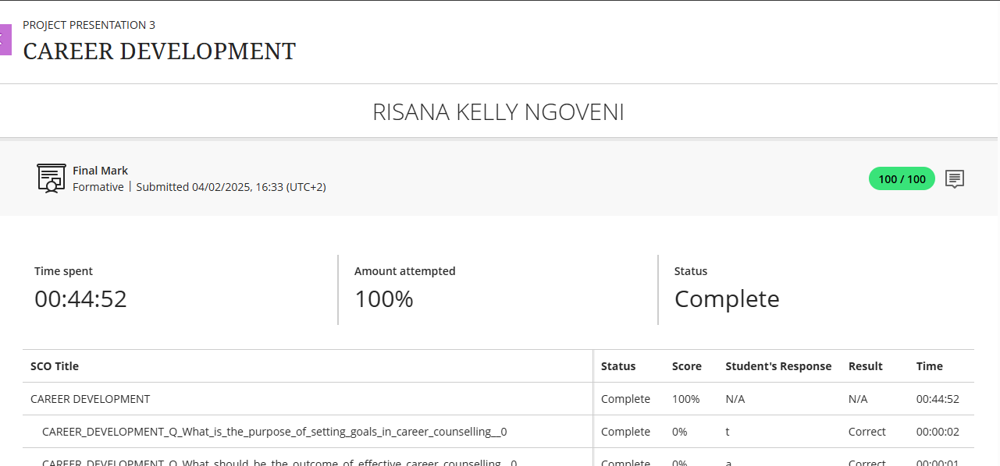
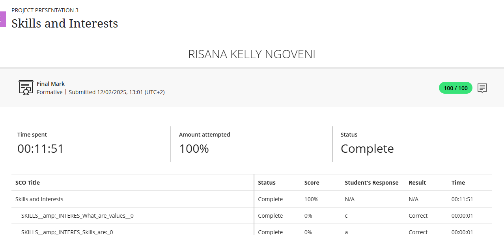
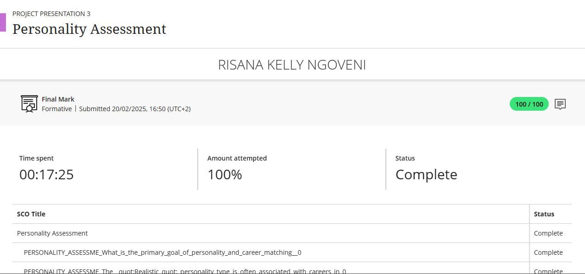
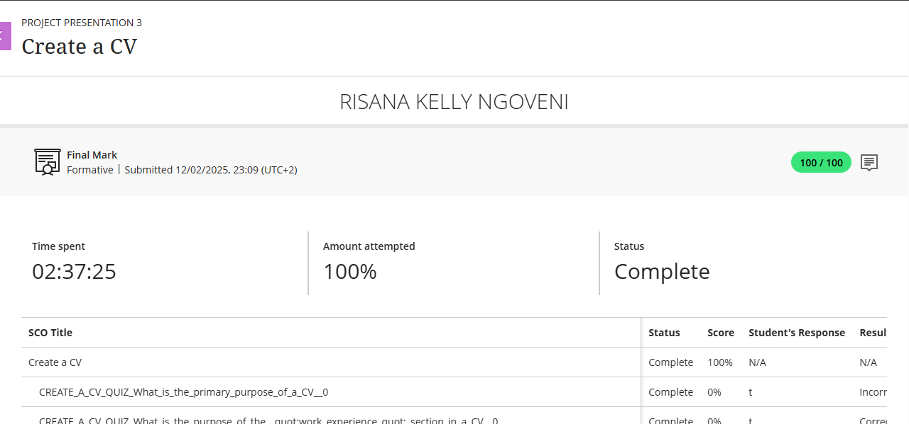

# Digital-Portfolio 

<i><b>Risana Kelly Ngoveni</b></i>

 <i>Third-Year ICT: Application Development | Cape Peninsula University of Technology</i>

 <b>Student Number:</b> 222578874

<i>Full Stack Developer/System Architect</i>

<i>Dedicated to creating innovative, efficient, and user-friendly applications with real-world relevance</i>

##  Introduction

As a third-year ICT (Application Development) student at Cape Peninsula University of Technology, I have developed a strong foundation in software development principles, systems analysis, and application design. My academic journey has shaped me into a problem-solver who is passionate about creating functional, user-centered software that addresses real-world needs.

This digital portfolio represents my growth as an aspiring software developer. It showcases key projects, practical experiences, and reflective insights that highlight my readiness to contribute meaningfully in professional environments. Whether through mobile apps, web solutions, or database-driven systems, my goal is to build impactful technologies that blend innovation with usability.

## Career Counseling

### Evidence 
- A reflective summary report based on my participation in the Career Development module, focusing on aligning my strengths and skills with current industry demands.
- Visual documentation showcasing activities and tasks completed during the career development workshop.

###  Reflection (STAR)

**S**ituation: As I approached the final stages of my studies, I realized I needed clearer direction regarding my future career path in the tech industry.  

**T**ask: My goal was to gain professional insight and practical guidance to align my personal strengths and interests with suitable career opportunities.  

**A**ction: I actively engaged with the Career Development module, completed self-assessment exercises, participated in workshops, and consulted with the campus career office.  

**R**esult: Through this process, I gained valuable clarity about the roles within tech that best align with my skills and passions—particularly in areas like software development and systems analysis—empowering me to make more informed career decisions moving forward.

---
## Skills and Interests

### 📄 Evidence

- **Core Technical Skills:**  
  Java · JavaScript · MySQL · HTML/CSS · Python · Figma · Agile · Scrum  

- **Electives (2023/2024):**  
  ▫️ *Python Programming* — Focused on logic building, data structures, and automation  
  ▫️ *Greenfoot* — Object-oriented programming using Java in a visual and interactive environment  

- **Personal Interests:**  
  Data science · Software development · UX/UI design · Gamified learning systems

###  Reflection (STAR)

**S**ituation: Throughout my academic journey, I was introduced to a wide range of technologies and development tools.  

**T**ask: I needed to identify which skills and areas of tech aligned best with my interests and strengths.  

**A**ction: I actively engaged in various tech projects and intentionally chose Data Analytics as an elective to broaden my technical perspective and explore data-driven decision-making.  

**R**esult: I developed strong data interpretation and analytical thinking skills, and discovered a genuine passion for creating systems that deliver value through meaningful insights.

## Personality Assessment

### Evidence

- **Summary:**  
  I completed a series of online self-assessments as part of the career development module. The results highlighted my dominant traits as:  
  ▫️ **Analytical** – I enjoy solving complex problems through logical thinking.  
  ▫️ **Curious** – I am eager to learn new technologies and explore innovative solutions.  
  ▫️ **Empathetic** – I consider user needs and perspectives in design and development.  
  ▫️ **Adaptive** – I adjust easily to new challenges and fast-paced environments.  

### Reflection (STAR)

**S**ituation: I felt uncertain about how my personality traits aligned with roles in the tech industry.  

**T**ask: My goal was to better understand my working style and uncover the soft skills that could support my growth in team-based environments.  

**A**ction: I completed structured personality and career assessment tests, then critically reflected on the results to draw connections to real-world team and leadership dynamics.  

**R**esult: I gained valuable insight into my strengths in leadership, communication, and collaboration—skills that are essential for thriving in software development and cross-functional tech teams.

---
## Create a CV

### Evidence 
 - A visual snapshot of how to create a CV highlighting qualifications, technical skills, and academic journey.
   
  Overviews of key projects that I have worked on:
  ▫️ **Student Enrollment System** – A sustainability-focused application  

▫️ **Java-based voting system** – Demonstrating object-oriented programming skills

###  Reflection (STAR)

**S**ituation: I needed a professional CV to apply for the Capitec Work Integrated Learning (WIL) program, DHL Learnship program, and Graduate Program for Pick n Pay.  

**T**ask: My objective was to create a clear, well-structured resume that effectively highlights my academic achievements, technical skills, and project experience.  

**A**ction: I gathered details of relevant coursework, personal and group projects, and technical competencies, then formatted them into a clean, professional layout using concise and impactful language.  

**R**esult: I produced a strong CV that aligns with my career goals and meets industry expectations—ready for submission to internship and entry-level opportunities like the Capitec WIL program.

---
## CV Submission

###  Evidence

- Submitted a customized CV and tailored cover letters to the following opportunities:  
  ▫️ **Capitec Bank** – Work Integrated Learning (WIL) program  
  ▫️ **DHL** – Learnership Program  
  ▫️ **Pick n Pay** – Graduate Development Program  

https://github.com/1248Kelly/Digital-Portfolio/blob/main/RisanaCV.pdf

###  Reflection (STAR)

**S**ituation: I wanted to apply for multiple work-integrated learning and graduate programs to gain valuable industry experience.  

**T**ask: My task was to write compelling, tailored cover letters and submit professional applications to Capitec’s WIL program, DHL’s Learnership, and Pick'n Pay’s Graduate Program.  

**A**ction: I researched each company’s mission, values, and program details thoroughly. I then customized my cover letters to align my skills and career goals with what each organization values most.  

**R**esult: I submitted polished, personalized applications to all three programs, increasing my chances of securing meaningful work experience in the ICT field.

###  [Car Rental Company Mobile App UX – View Prototype on Figma]
https://www.figma.com/files/team/1491486525627834618/recents-and-sharing?fuid=1220534951971721751
- UX/UI prototype designed to streamline the car rental experience by offering easy vehicle browsing, booking, and customer support through a mobile app.
- Developed using Design Thinking methodology, applying Gestalt principles and UX/UI best practices to ensure intuitive navigation and user satisfaction.

## Overall Reflection-Connecting My Journey
Throughout my journey as a third-year (Application Development)student at Cape Peninsula University of Technology, I have steadily grown from learning core programming concepts to applying them in real-world systems. Each project I completed strengthened different aspects of my technical and professional development.

Working on the FID-WIL Management System deepened my understanding of full-stack development and real-world problem-solving. By building both the front-end and backend, as well as the notification module, I learned how to design systems that connect businesses and students effectively, helping them manage internships and work-integrated learning placements. Developing the Car Rental Website gave me valuable experience in integrating both the presentation and logic layers. I built the payment page's frontend and backend, applying secure transaction logic and improving my confidence in handling data validation and form submissions between the client and server sides.

The Grocery Mobile App(Android Studio)challenged me to work with mobile technologies, where I implemented both the notification page backend and the corresponding user interface. This project enhanced my understanding of Android app structure, user interface design, and API connectivity, similar to modern e-commerce apps like Checkers 60. These experiences, combined with the career development activities from my work readiness training, have helped me connect my technical skills with my personal traits such as adaptability, analytical thinking, and empathy. I now view myself as a growing full-stack developer who can design and implement solutions from concept to deployment while considering usability and user experience. This portfolio captures that progression and demonstrates my readiness to contribute meaningfully to professional ICT environments.

## FID-WIL Management System

## Overview:
The FID-WIL Management System is a web-based platform designed to connect students with companies offering Work Integrated Learning (WIL) opportunities. It streamlines the internship process by allowing students to create profiles, apply for placements, and track their progress, while companies can post vacancies, review applications, and provide feedback.

## My Role & Responsibilities:
I contributed to both the frontend and backend components of the system. My primary focus areas included:

Developing the Notification Module to alert students and companies about new placements or status updates.

Assisting with database design and integration between the user interface and MySQL backend.

Participating in code reviews, testing, and debugging to ensure a smooth user experience.

## Technologies Used:
 ▫️ **Java** 
 ▫️ **Spring Boot** 
 ▫️ **MySQL**
 ▫️ **HTML**
 ▫️ **CSS** 
 ▫️ **JavaScript**

Key Features:

Student and Company Registration

WIL Opportunity Posting and Application Management

Automated Email Notifications

Progress Tracking and Reporting

##Outcome & Learnings:##
This project enhanced my understanding of full-stack development and teamwork in a collaborative environment. I learned how to design and implement backend services, manage relational databases, and ensure secure, efficient data handling. It also improved my ability to work under real project constraints and apply agile methodologies.

### Reflection (STAR)

**S**ituation:
During the development of the FID-WIL Management System, our team needed a way to notify students and companies about updates related to internship applications and approvals.

**T**ask:
My task was to design and implement a Notification Module that could automatically send alerts and updates between the student and company interfaces.

**A**ction:
I developed the backend logic using Java and Spring Boot, created database tables for notification tracking in MySQL, and integrated the functionality with the existing user interface. I also tested the system to ensure that notifications were sent correctly when certain actions occurred.

**R**esult:
The notification feature worked successfully, improving communication between students and companies and enhancing the overall usability of the system. Through this process, I gained hands-on experience in backend integration, debugging, and teamwork within a full-stack project environment.

Step 1: Collect

I have collected the following artefacts as evidence of my learning and development throughout my ICT studies:

1. Career Counseling

Reflective summary report from the Career Development module

Career Quiz results

Workshop participation documentation

Screenshot of Career Quiz and workshop activities

2. Skills and Interests

Core Technical Skills: Java, JavaScript, MySQL, HTML/CSS, Python, Figma, Agile, Scrum

Elective Courses:

Python Programming – Focused on logic building, data structures, and automation

Greenfoot – Object-oriented programming in a visual, interactive environment

Screenshot of skills and electives

3. Personality Assessment

Results from online personality assessment tests

Screenshot of personality assessment results

4. CV Submission

Customized CV and tailored cover letters for:

Capitec WIL program

DHL Learnership program

Pick n Pay Graduate Program

PDF link to CV: Risana CV PDF

Screenshot of CV and cover letters

5. Projects

FID-WIL Management System: Admin Dashboard, Home Page, Notification Module screenshots

Car Rental Mobile App: Figma UX/UI prototype screenshot / link

Grocery Mobile App: Backend notification page and UI screenshots

##  Contact Me

-  Email: kellyngoveni23@gmail.com  
-  Phone: 061 452 1060

